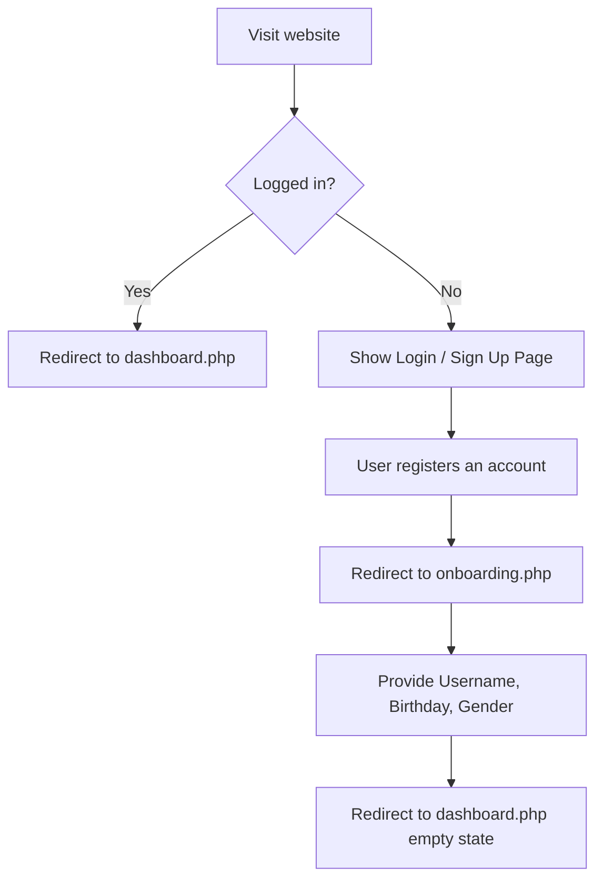
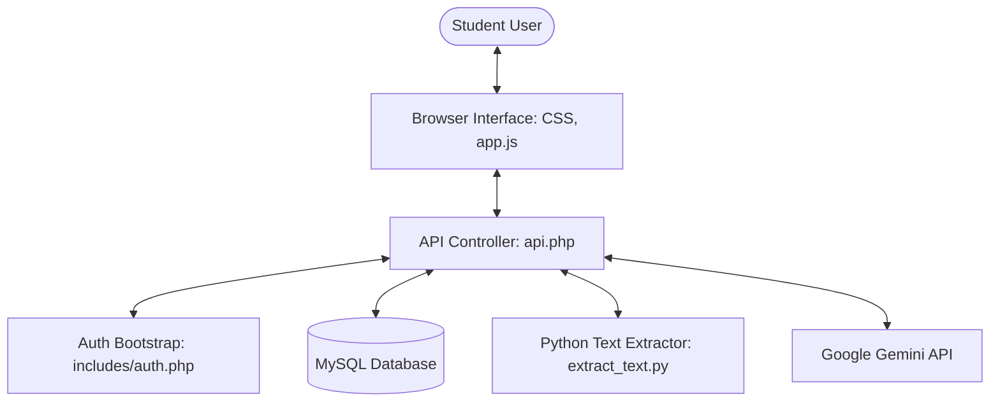
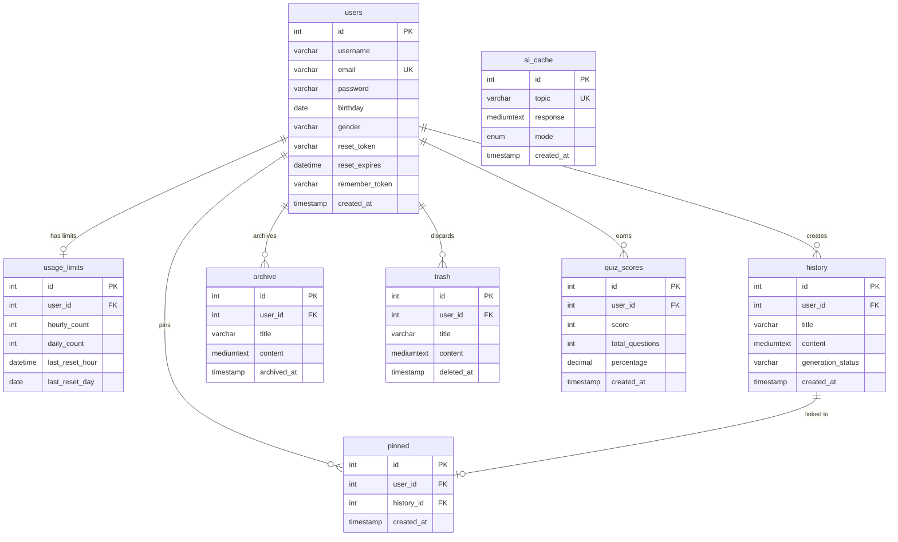

# AI Study Tracker & Reviewer — Official Website & Developer Documentation

Welcome to the official system manual, onboarding guide, and product documentation for the **AI Study Tracker & Reviewer**. This comprehensive documentation covers user workflows, design parameters, system architecture, database design, API endpoints, security implementations, and developer references.

---

## 1. Introduction

### What is the Website?
The **AI Study Tracker & Reviewer** is an intelligent, self-paced academic assistant that transforms unstructured learning resources—such as text summaries, handwritten notes, textbooks, lecture PDFs, Word documents, or photos of whiteboards—into organized, interactive study guides and exam-ready quizzes.

### Purpose of the Platform
The platform bridges the gap between raw, disorganized study materials and structured active recall study methods. By integrating the Google Gemini API, it automates the synthesis of long texts into formatted lessons and builds multiple-choice assessment modules, helping users gauge their understanding and track study performance over time.

### Target Users
* **Students** preparing for school, university, or licensing examinations.
* **Self-paced learners** studying new subjects, programming languages, or concepts.
* **Educators** looking to quickly generate study guides and quiz templates for students.
* **Professionals** reviewing certification materials or technical documentation.

### Main Objectives
1. **Automate Content Synthesis:** Transform complex topics and multi-page documents into structured, 8-part learning concepts.
2. **Facilitate Active Recall:** Generate context-aware, 20-question multiple-choice quizzes with explanations to enforce understanding.
3. **Optimized Resource Management:** Enforce strict hourly and daily token limits per user to prevent high API expenses and control resource distribution.
4. **Resilient Local Execution:** Provide pre-packaged mock templates to simulate AI operations when external API connections are offline or keys are missing.

---

## 2. Design System

The platform's design combines dark-themed navigation interfaces with a clean, low-fatigue workspace layout. Smooth micro-animations, dynamic hover states, and clear feedback alerts provide a premium user experience.

### Typography
The visual interface uses a clean, high-readability sans-serif font hierarchy:
* **Primary Font:** Poppins
* **Fallback Font:** sans-serif
* **Source:** Google Fonts (imported via `@import url('https://fonts.googleapis.com/css2?family=Poppins:wght@300;400;500;600;700;800&display=swap')`)
* **Weights Used:**
  * `300` Light
  * `400` Regular (body text, input fields, descriptions)
  * `500` Medium (tab navigation, lists, sub-header labels)
  * `600` SemiBold (accordion headers, buttons, cards titles)
  * `700` Bold (headers, primary action links, modal headings)
  * `800` ExtraBold (brand logo, percentage grades, empty state titles)
* **Font Sizes Used:**
  * Base Font Size: `15px` declared on `html`/`body`
  * Main Dashboard Welcome Header: `1.8rem`
  * Card Titles & Forms: `1.45rem`
  * Body Text: `0.88rem` to `0.95rem`
  * History / Secondary Labels: `0.8rem` to `0.82rem`
  * Small Helper Texts: `0.75rem`

---

### Color Theme
All design colors are controlled using CSS Custom Properties declared in the `:root` scope of `assets/css/style.css`.

| Variable Name | Hex Code | Visual Placement | Purpose & Meaning |
| :--- | :--- | :--- | :--- |
| `--navy` | `#1a1f36` | Sidebar navigation, auth brand panel, settings headers | Brand identification, high-contrast structural containment |
| `--white` | `#ffffff` | Workspace cards, main body background, button text | Primary surface color, high readability canvas |
| `--blue` | `#2058dc` | Primary action buttons, active navigation states, user bubbles | Highlights main actions, prompts, and active selections |
| `--silver` | `#d9d9d9` | Input border, scrollbar thumb, inactive tab backgrounds | Muted outlines, borders, and inactive structures |
| `--black` | `#000000` | Headers, text content, primary labels | High-contrast readability for primary textual elements |
| `--gold` | `#fdda51` | Logo accents, active gender state borders, celebration card | Accent decoration and premium rating highlights |
| `--red` | `#ff3131` | Error notices, invalid input indicators, delete/logout actions | Cautionary alerts, validation errors, and destructive actions |
| `--green` | `#007a3f` | Success banners, valid choice buttons, high quiz score cards | Validation approval, success messaging, and correct answers |
| `--gray` | `#737373` | Subtexts, informational labels, icons, inactive menu text | Muted secondary metadata and passive UI indicators |
| `--bg` | `#f4f6fb` | Main content canvas area | Soft, low-contrast background to minimize eye strain |

---

### Icons
The application uses the Google Material Icons library.
* **Source:** [Google Material Design Icons](https://fonts.google.com/icons)
* **Usage details:**

| Icon Name | Placement Location | Purpose and Action |
| :--- | :--- | :--- |
| `add` | Sidebar "New Task" Button, Modal Action | Resets current chat state, clears localStorage, and redirects to home empty state. |
| `home` | Sidebar Navigation Menu | Switches main workspace view to the interactive home/chat dashboard. |
| `push_pin` | Sidebar Accordion & Item Row, Context Menu | Pins / unpins a study session to the sticky sidebar quick access container. |
| `fact_check` | Sidebar Navigation Accordion | Toggles the list of the last 30 recent study history items. |
| `inventory_2` | Sidebar Accordion, Chat Notice, Context Menu | Moves active chats to the archive list, hiding them from primary history. |
| `bar_chart` | Sidebar Navigation Menu | Switches workspace to the metrics and token usage dashboard. |
| `settings` | Sidebar Footer Navigation | Displays account info, password reset inputs, trash list, and clear data buttons. |
| `logout` | Sidebar Footer, Settings view, Confirm Modal | Ends active session, clears remember-me hashes, and redirects to login. |
| `upload` | Empty State & Active Chat Prompt Bar | Triggers hidden native browser file selector for PDFs, Word files, or images. |
| `arrow_upward` | Empty State & Active Chat Prompt Bar | Submits topic text input and uploaded files to the AI generator. |
| `visibility` | Password Fields (Forms) | Toggles hidden password input to readable plain text format. |
| `visibility_off` | Password Fields (Forms) | Masks plain text input back into password format. |
| `mail` | Authentication Forms | Represents text field input requirements for email addresses. |
| `lock` | Password Reset & Auth Forms | Represents input requirements for security credentials. |
| `cake` | Onboarding / Edit Profile Modals | Visual label representing user birthday selection. |
| `person` | Onboarding / Edit Profile Modals | Visual label representing username input fields. |
| `done` | Confirm Password Input Field | Represents successful confirmation match checks. |
| `arrow_back` | Forgot Password Navigation Header | Redirects user from password recovery view back to authentication screen. |
| `expand_more` | Accordion Header Buttons | Indicates that a section (Pinned, History, Archive) is currently collapsed. |
| `expand_less` | Accordion Header Buttons | Indicates that a section is expanded and lists study items. |
| `more_horiz` | History Item Row Buttons | Displays fixed context options menu (Rename, Archive, Pin/Unpin, Delete). |
| `close` | Account Details Modal Header | Closes active modal window overlay. |
| `edit` | Account Details Modal Actions | Closes detail card and displays Edit Profile form sheet modal. |
| `delete` | Trash list items, Settings headers, Context Menu | Marks files for permanent deletion or displays soft-deleted elements. |
| `warning_amber` | Delete Account Confirmation Modal | Warnings for irreversible account wipe operations. |
| `chat_bubble_outline` | History Item Icons | Represents standard saved study dialogue chats. |
| `assignment` | Quiz start, quiz resume system messages | Identifies active interactive questionnaire modules. |
| `check_circle` | Answer checking feedback, password rule markers | Highlights correct selections and validated rule completions. |
| `cancel` | Answer checking feedback, password rule markers | Highlights incorrect selections and invalidated requirements. |
| `celebration` | Quiz Summary Card (Score >= 90%) | Visual reward for excellent performance reviews. |
| `menu_book` | Quiz Summary Card (Score < 31%) | Visual indication suggest studying more materials. |
| `replay` | Quiz Summary Card Actions | Resubmits lesson text to instantly regenerate a new randomized test deck. |
| `picture_as_pdf` | Prompt Bar & Chat Message File Chips | Indicates that an uploaded resource is a PDF file. |
| `description` | Prompt Bar & Chat Message File Chips | Indicates that an uploaded resource is a Microsoft Word Document. |
| `text_snippet` | Prompt Bar & Chat Message File Chips | Indicates that an uploaded resource is a Plain Text document. |
| `warning` | Generation failure banners | Alerts the user that a background AI processing request failed. |

---

## 3. Website Tour Guide

### A. Authentication & Onboarding
1. **Split-Screen Landing Page:**
   * **Left Brand Panel:** Features the brand logo mark, title "Study Tracker" (with custom gold highlight), and the platform subtitle "AI-powered lessons & quizzes".
   * **Right Auth Card:** Houses the navigation tabs to toggle between "Log In" and "Sign Up". Below the tabs, it displays contextual success/error alert banners, CSRF tokens hidden inside forms, input fields equipped with prefix icons (mail, lock), password toggle buttons (visibility icons), a "Remember me" checkbox, and a recovery hyperlink.
2. **Password Validation Tooltip:** Appears when entering a password on the "Sign Up" form. It highlights 5 parameters in green/red dynamically as characters are typed: length, uppercase, lowercase, number, and special character.
3. **Onboarding Panel:** A dedicated form that appears on the user's first visit after registration, collecting their Username, Birthday, and Gender (using radio card buttons for Male, Female, and Other).

---

### B. Navigation Sidebar
Located on the left side of the screen.
* **Brand Header:** Displays the Study Tracker icon, logo title, and text.
* **"New Task" Button:** A blue, primary button containing a `+` icon. Clicking it resets active state markers, wipes local state values (`activeHistoryId`), and displays the blank home screen mode choices.
* **Menu Options:**
  * **Home:** Navigates back to the main study workspace canvas.
  * **Pinned Accordion:** Toggles a sub-navigation list displaying study sessions marked with a pin.
  * **Recent & History Accordion:** Toggles a list of the last 30 recent sessions. Long titles automatically perform a scroll marquee effect when hovered.
  * **Archive Accordion:** Displays archived sessions, keeping them separate from the active history.
  * **Analytics:** Toggles the metrics dashboard.
* **Sidebar Footer:**
  * **Settings Button:** Launches the account configurations page.
  * **Log Out Button:** Triggers the logout modal window to clear security credentials.

---

### C. Top Bar (Header)
Located at the top of the main panel.
* **Greeting Block:** Displays the user's first name extracted from their username (e.g. "Welcome, John") and provides a brief operational guideline.
* **Network Connectivity Status Pill:** A dynamic indicator that monitors browser connectivity:
  * Green **Connected** state: online connection verified.
  * Amber **No Internet** state: offline.

---

### D. Main Workspace Canvas
Located in the center of the screen, updating dynamically.
1. **Empty State Workspace:**
   * Displays the greeting header "Let's get started....".
   * **Mode Action Selectors:** Two toggles ("Start a lesson" or "Start quiz") that set the active mode. Button shakes as a warning if a user tries to send a prompt before choosing a mode.
   * **Prompt Bar:** Centered text area with auto-resizing heights. Houses the upload trigger button, file preview thumbnails (with delete buttons), and the send icon.
2. **Active Dialogue Workspace:**
   * **Chat Thread:** Renders message bubbles chronologically. User messages align right with personal profile avatars; AI cards align left with brand logo icons.
   * **Formatted Markdown Cards:** Renders lessons in styled HTML.
   * **Interactive Quiz Module:** Renders multiple-choice questions one at a time. The choices are button arrays that lock after selection, highlighting correct selections in green and incorrect selections in red.
   * **Bottom Sticky Input Bar:** Allows users to submit follow-up prompts or answers (supports typing A, B, C, or D to select quiz options).
   * **Archived Notification Banner:** Replaces the prompt inputs if a session is archived. Shows: "This chat is archived. Restore it to continue the conversation."

---

### E. Analytics Dashboard
Displays study metrics:
* **Progress Card:** Progress metric calculated as: `(Lessons * 10) + (Quizzes * 8) %` (capped at 100%).
* **Lessons Studied:** Total count of generated study sessions.
* **Quizzes Taken:** Total count of saved test records.
* **Average Score:** Mean score of all completed quizzes, displayed as a percentage.
* **Usage Limits Gauges:** Visual progress metrics showing remaining hourly and daily tokens.

---

### F. Settings Panel & Trash Section
Manages user configurations, safety tools, and data recovery:
* **Account Info Block:** Displays Username, Email, and Join Date. Clicking the "More Info" button triggers a modal with gender/birthday metrics, plus buttons to trigger "Edit Profile" or "Delete Account".
* **AI Limits Panel:** Showcases hourly (20) and daily (100) system caps.
* **Trash Section:** Displays soft-deleted study sessions. Inside this section, users can find:
  * Restorative options to return items to history.
  * A permanent delete button.
  * An "Empty Trash" button to wipe the trash bin.
* **Danger Zone Block:**
  * **Log out of all sessions:** Wipes cookies and invalidates login tokens.
  * **Clear Data:** Erases all history, scores, trash, and archives. Requires typing "CLEAR" in a text input to verify the action.

---

### G. Modals Overlay System
* **Move to Trash Confirm (`deleteModal`):** Soft-deletes a session and moves it to the trash folder.
* **Archive Confirm (`archiveModal`):** Moves an active study guide into the archive list.
* **Trash Delete Confirm (`trashPermanentModal`):** Deletes a trash folder item permanently.
* **Empty Trash Confirm (`emptyTrashModal`):** Clears the trash container.
* **Logout Confirm (`logoutModal`):** Prompts the user before terminating the session.
* **Clear Data Confirm (`clearDataModal`):** Deletes all user data (requires typing "CLEAR" to unlock).
* **Account Details Info (`moreInfoModal`):** Displays profile information and handles edit profile/delete account triggers.
* **Edit Profile Form (`editProfileModal`):** Form inputs to edit Username, Birthday, Gender, and reset passwords.
* **Delete Account Final Confirm (`deleteAccountModal`):** Prompts for password validation before executing a full database account wipe.

---

## 4. Complete Feature Documentation

### Dynamic Study Lesson Generator
* **Description:** Parses a topic or document and generates a structured, 8-part learning card.
* **Location:** Primary Workspace.
* **User Workflow:**
  1. Select "Start a lesson" mode on the dashboard.
  2. Input a target topic, paste textbook content, or upload study documents.
  3. Click the send button to submit the prompt.
  4. Review the generated lesson. Users can click "Quiz" at the bottom of the card to test their knowledge, or "More Lesson" for simplified explanations.
* **Technical Workflow:**
  * The frontend submits the content to `api.php?action=ai` with `mode=lesson`.
  * The backend verifies the CSRF token, deducts 2 tokens from the user's budget, checks for cached content, and queries Gemini.
  * The server immediately returns a `processing` status to the client, while continuing to run in the background via `ignore_user_abort(true)`.
  * The backend updates the database with `generation_status='processing'`. The client polls `api.php?action=history_open` every 3 seconds until status returns to `idle`.
* **Related Components:** [api.php](file:///c:/xampp/htdocs/ai-study-tracker/api.php#L400-L525), [app.js](file:///c:/xampp/htdocs/ai-study-tracker/assets/js/app.js#L1180-L1352), [config.php](file:///c:/xampp/htdocs/ai-study-tracker/config/config.php#L142-L160)

---

### Interactive Quiz Engine
* **Description:** Generates a randomized multiple-choice quiz based on study materials.
* **Location:** Main Workspace.
* **User Workflow:**
  1. Select "Start quiz" on home layout, or click the "Quiz" action button at the bottom of a generated lesson.
  2. Provide a topic or upload notes.
  3. Submit the prompt. The system will display questions one by one.
  4. Click a choice button to select an answer. Correct selections display in green; incorrect in red.
  5. View the final performance card and recommendations on the screen.
* **Technical Workflow:**
  * Submits the prompt to Gemini, requesting a raw JSON payload matching the following format:
    `{"questions": [{"question": "...", "choices": ["...", "...", ...], "answer": 0, "explanation": "..."}]}`
  * The backend parses the JSON string, strips letter prefixes (A, B, C, D) from choice texts, and saves the state structure.
  * The frontend tracks the current index, user answers, and total score. Progress is saved in the database after every question to support recovery on page refresh.
  * Once the quiz completes, the score is sent to `api.php?action=save_score` to update the user's analytics.
* **Related Components:** [api.php](file:///c:/xampp/htdocs/ai-study-tracker/api.php#L272-L280), [app.js](file:///c:/xampp/htdocs/ai-study-tracker/assets/js/app.js#L1720-L1920)

---

### Multi-Format Document Parser
* **Description:** Extracts text from uploaded files and images to construct prompt contexts.
* **Location:** Prompt Bar inputs.
* **User Workflow:** Click the upload icon to select a file (`.txt`, `.pdf`, `.docx`) or image. The interface will render a preview thumbnail in the prompt bar before submission.
* **Technical Workflow:**
  * **Images:** Encoded directly into Base64 format in PHP and passed in the API call payload.
  * **Plain Text (.txt):** Read directly on the server and converted to UTF-8.
  * **Microsoft Word (.docx):** Parsed using PHP's native `ZipArchive` utility to read plain text strings from `word/document.xml`.
  * **Adobe PDF / Docx Fallback:** Written to a temporary directory (`uploads/`) and processed using a Python helper script (`python/extract_text.py`) with the `pypdf` library.
  * **Clean Up:** The temporary file is immediately deleted using `unlink()` once text extraction is complete. Text is limited to 30,000 characters to prevent overloading the Gemini API.
* **Related Components:** [extract_text.py](file:///c:/xampp/htdocs/ai-study-tracker/python/extract_text.py), [api.php](file:///c:/xampp/htdocs/ai-study-tracker/api.php#L651-L715)

---

### Session Lifecycle Management
* **Description:** Handles transitions between session states: active history, pinned items, archives, and trash.
* **Location:** Sidebar, Chat headers, and Context Menus.
* **User Workflow:** Hover over any item in the sidebar list and click the three dots button to select an action (Rename, Pin/Unpin, Archive, Delete).
* **Technical Workflow:**
  * Operations are handled transitionally using SQL queries in `api.php`.
  * **Pinning:** Adds the session ID to the `pinned` table. The item is then excluded from the general history view list query.
  * **Archiving:** Deletes the record from history and pinned tables, and copies the contents to the `archive` table.
  * **Soft Deletion:** Moves the session records to the `trash` table and deletes them from history/pinned tables.
  * **Wiping:** Soft-deleted records can be restored back to history, or deleted permanently.
* **Related Components:** [api.php](file:///c:/xampp/htdocs/ai-study-tracker/api.php#L20-L270), [app.js](file:///c:/xampp/htdocs/ai-study-tracker/assets/js/app.js#L98-L384)

---

### Profile Customization & Security Update
* **Description:** Updates profile metrics, password credentials, or executes account deletion.
* **Location:** Settings view & Modals.
* **User Workflow:** Open Settings, view details, and change credentials in the profile edit screen. Confirm with your password to save changes or delete your account.
* **Technical Workflow:**
  * Password updates require validating the user's current password against the hashed value in the database.
  * Password complexity is validated on the server using the helper function `password_is_strong()`.
  * Account deletion uses SQL database transaction blocks, deleting user references from `trash`, `archive`, `pinned`, `history`, and `quiz_scores` tables, before deleting the user record from the `users` table.
* **Related Components:** [api.php](file:///c:/xampp/htdocs/ai-study-tracker/api.php#L282-L397), [app.js](file:///c:/xampp/htdocs/ai-study-tracker/assets/js/app.js#L2043-L2193)

---

## 5. User Journey Documentation

### First Visit

* **Landing Page:** Guests land on `index.php`, which automatically resets active session keys.
* **Registration:** Users create an account by entering their email, password, and password confirmation.
* **Profile Setup:** Users are redirected to `onboarding.php` to complete their profile (Username, Birthday, and Gender).
* **Dashboard Redirect:** Users are redirected to `dashboard.php` once their profile is set up.

---

### Returning User
* **Remember-Me Cookie Check:** `includes/auth.php` checks for a `remember_token` cookie. If found, it hashes the cookie value using SHA-256 and matches it against the database.
* **Dashboard Access:** If a match is found, the system regenerates the session ID, loads the user session, and redirects to `dashboard.php`.
* **Session Recovery:** The frontend check `localStorage.getItem('activeHistoryId')` recovers the last active chat session, polling the server if the status is still marked as `processing`.

---

### Logout Process
* **Triggers:** The user clicks the "Log Out" link in the sidebar or settings panel, and confirms the action.
* **Session Clean Up:**
  1. The browser calls `logout.php`.
  2. The server sets the user's `remember_token` to `NULL` in the database.
  3. The remember-me cookie is set to expire in the past.
  4. The PHP session is destroyed.
  5. The user is redirected back to `index.php?mode=login`.

---

## 6. Authentication Documentation

### Sign Up
* **Input Parameters:** `email`, `password`, `confirm_password`.
* **Validation Rules:**
  * Email must be validated using `FILTER_VALIDATE_EMAIL`.
  * Password and confirmation password must match exactly.
  * Password must be between 8 and 30 characters, and contain at least one uppercase letter, one lowercase letter, one digit, and one special character.
* **Database Action:**
  * Checks if the email is already registered.
  * Generates a display name from the email prefix.
  * Hashes the password using PHP's native `password_hash($pass, PASSWORD_DEFAULT)` function before inserting it into the `users` table.

---

### Login
* **Input Parameters:** `email`, `password`, `remember` (checkbox).
* **Validation Rules:** Checks if the email and password are valid and match a database record.
* **Database Action:**
  * Verifies the password against the database hash using `password_verify()`.
  * If the "Remember me" checkbox is checked, the system generates a cryptographically secure 32-byte token via `random_bytes(32)`.
  * The token is hashed using SHA-256 and saved in the user's database record. The raw token is sent to the client as a secure HTTP-only cookie.

---

### Password Recovery
* **Requesting Reset Link:**
  1. The user inputs their email address on `forgot_password.php`.
  2. The system verifies if the email exists in the database.
  3. Generates a secure random token, hashes it using SHA-256, and stores it in the user's record with a 30-minute expiration timestamp (`DATE_ADD(NOW(), INTERVAL 30 MINUTE)`).
  4. Renders the recovery link on the screen (in production, this should be sent via email).
* **Resetting Password:**
  1. The user clicks the recovery link containing the raw token.
  2. The system hashes the token and verifies it against the database.
  3. The user enters a new password, which is validated, hashed, and updated in the database. The token and expiration fields are reset to NULL.

---

## 7. Token System Documentation

The token limit system ensures fair API usage, controls computational overhead, and protects against resource abuse.

### What Are Tokens?
Tokens measure resource usage for AI tasks. They are deducted from the user's budget when lessons or quizzes are generated.

### Why Tokens Exist
Each call to the Gemini API has a cost. The token budget prevents users from making excessive concurrent requests that could overload the server or exhaust the API quota.

### How Users Receive Tokens
Tokens are allocated automatically:
* **Hourly Budget:** 20 tokens.
* **Daily Budget:** 100 tokens.

### How Tokens Are Consumed
Different tasks have different token costs:
* **Lessons:** Cost **2 tokens** (standard input).
* **Quizzes:** Cost **3 tokens** (requires structured JSON formatting).

### Token Balance Tracking
Token usage is tracked in the `usage_limits` table and displayed on the Analytics dashboard. Balance status is returned in every API call.

```sql
CREATE TABLE IF NOT EXISTS usage_limits (
    id              INT AUTO_INCREMENT PRIMARY KEY,
    user_id         INT  NOT NULL UNIQUE,
    hourly_count    INT  NOT NULL DEFAULT 0,
    daily_count     INT  NOT NULL DEFAULT 0,
    last_reset_hour DATETIME NOT NULL,
    last_reset_day  DATE     NOT NULL,
    FOREIGN KEY (user_id) REFERENCES users(id) ON DELETE CASCADE
);
```

### Token Security
Updates and deductions are executed atomically using SQL queries:
```sql
UPDATE usage_limits 
SET hourly_count = hourly_count + ?, 
    daily_count = daily_count + ? 
WHERE user_id = ?
```

### Anti-Abuse Protection
Token counts reset automatically when the user performs an action after the expiration of the token window (1 hour for the hourly limit, 24 hours for the daily limit). If generation fails, tokens are refunded.

### Practical Token Scenarios

```text
Scenario A: First Study Session of the Day
1. Initial Budget:  Hourly: 0/20 | Daily: 0/100
2. User Action:      Generates 1 Lesson (cost = 2)
3. DB Action:        Increments hourly and daily counts.
4. Final Budget:    Hourly: 2/20 | Daily: 2/100

Scenario B: Rate Limit Enforcement
1. Initial Budget:  Hourly: 19/20 | Daily: 40/100
2. User Action:      Generates 1 Quiz (cost = 3)
3. DB Action:        Determines that 19 + 3 (22) exceeds the hourly limit (20).
                     Blocks the request. No tokens are deducted.
4. User Message:     "Sorry, you only have 1 token left... Please return at [Reset Time]"
```

---

## 8. Security Documentation

The platform implements security measures across several domains:

* **Authentication Security:** Passwords are encrypted using PHP's `password_hash()` with the `PASSWORD_DEFAULT` algorithm. Persistent login sessions use SHA-256 hashed tokens stored in HTTP-only cookies, protecting them from cross-site scripting (XSS) leaks.
* **Authorization:** Secure session checks (`current_user()`, `require_login()`) run on every page load and API request. Users can only access, modify, or delete resources associated with their own `user_id`.
* **Session Security:** Session variables are saved in a write-protected folder (`storage/sessions`) inside the workspace root. The session ID is regenerated upon login to prevent session fixation.
* **API Security:** Every write operation (POST request) requires CSRF verification using cryptographically secure tokens.
* **Rate Limiting:** Users are rate-limited via the hourly (20 tokens) and daily (100 tokens) limit system.
* **File Upload Protection:** Uploaded files are validated to ensure they do not exceed size limits (images must be under 4MB). Temporary files are processed in-memory or written to the `uploads/` directory, and are immediately deleted using `unlink()` after text extraction.
* **XSS Prevention:** User-generated inputs are escaped before rendering using the htmlspecialchars wrapper function `e()`.
* **SQL Injection Prevention:** Database queries use prepared statements via PDO, and SQL emulation is disabled:
  ```php
  PDO::ATTR_EMULATE_PREPARES => false
  ```
* **Secrets Management:** Sensitive keys and database credentials are stored in a `.env` file, which is kept outside the webroot and excluded from version control using `.gitignore`.
* **AI Abuse Protection:** The server-side educational guard checks inputs against list keywords to block prompts that are not related to study or education.

---

## 9. System Architecture

The application uses an MVC-inspired architecture.



* **Frontend:** Handles user interaction, client-side validation, markdown rendering, and background status polling.
* **Backend Controller (`api.php`):** Verifies request authentication, validates CSRF tokens, handles file extraction, queries the database, and connects to the Gemini API.
* **Python Extractor (`extract_text.py`):** Acts as a helper service called by PHP to extract text from PDF, Word, and text documents.

---

## 10. Database Documentation

The MySQL schema handles relationships using foreign key cascading deletes:



### Table Schema Details

#### `users`
Stores user profile information, hashed passwords, and session reset keys.
* `id` (INT, Primary Key, Auto Increment)
* `username` (VARCHAR)
* `email` (VARCHAR, Unique)
* `password` (VARCHAR, hashed using Bcrypt)
* `birthday` (DATE, Nullable)
* `gender` (VARCHAR, Nullable)
* `reset_token` (VARCHAR, Nullable)
* `reset_expires` (DATETIME, Nullable)
* `remember_token` (VARCHAR, Nullable)
* `created_at` (TIMESTAMP)

#### `usage_limits`
Tracks user token budgets.
* `id` (INT, Primary Key)
* `user_id` (INT, Foreign Key referencing `users.id` with CASCADE delete)
* `hourly_count` (INT)
* `daily_count` (INT)
* `last_reset_hour` (DATETIME)
* `last_reset_day` (DATE)

#### `history`
Stores study session logs. The JSON-formatted contents are loaded as chat histories.
* `id` (INT, Primary Key)
* `user_id` (INT, Foreign Key referencing `users.id` with CASCADE delete)
* `title` (VARCHAR)
* `content` (MEDIUMTEXT)
* `generation_status` (VARCHAR, default 'idle')
* `created_at` (TIMESTAMP)

#### `pinned`
Links study sessions pinned by the user.
* `id` (INT, Primary Key)
* `user_id` (INT, Foreign Key referencing `users.id` with CASCADE delete)
* `history_id` (INT, Foreign Key referencing `history.id` with CASCADE delete)
* `created_at` (TIMESTAMP)

#### `archive`
Stores archived study sessions.
* `id` (INT, Primary Key)
* `user_id` (INT, Foreign Key referencing `users.id` with CASCADE delete)
* `title` (VARCHAR)
* `content` (MEDIUMTEXT)
* `archived_at` (TIMESTAMP)

#### `trash`
Stores deleted study sessions, allowing users to restore them if needed.
* `id` (INT, Primary Key)
* `user_id` (INT, Foreign Key referencing `users.id` with CASCADE delete)
* `title` (VARCHAR)
* `content` (MEDIUMTEXT)
* `deleted_at` (TIMESTAMP)

#### `quiz_scores`
Stores historical quiz scores.
* `id` (INT, Primary Key)
* `user_id` (INT, Foreign Key referencing `users.id` with CASCADE delete)
* `score` (INT)
* `total_questions` (INT)
* `percentage` (DECIMAL)
* `created_at` (TIMESTAMP)

#### `ai_cache`
Caches generated study content to reduce API costs.
* `id` (INT, Primary Key)
* `topic` (VARCHAR, Unique)
* `response` (MEDIUMTEXT)
* `mode` (ENUM: 'lesson', 'quiz', 'chat')
* `created_at` (TIMESTAMP)

---

## 11. API Documentation

Every API request is authenticated. POST requests require a valid CSRF token header (`X-CSRF-TOKEN`) or field parameter (`csrf_token`).

### 1. Retrieve User Dashboard Stats
* **Endpoint:** `/api.php?action=stats`
* **Method:** `GET`
* **Description:** Returns the user's dashboard statistics and token usage limits.
* **Authentication Required:** Yes
* **Request Parameters:** None
* **Response (JSON):**
  ```json
  {
    "ok": true,
    "stats": {
      "progress": 25,
      "lessons": 2,
      "quizzes": 1,
      "average": 85.0,
      "hourly": 4,
      "hourlyLimit": 20,
      "daily": 4,
      "dailyLimit": 100
    }
  }
  ```

---

### 2. Retrieve Unpinned History List
* **Endpoint:** `/api.php?action=history_list`
* **Method:** `GET`
* **Description:** Retrieves the user's recent, unpinned study sessions (limited to the last 30 items).
* **Authentication Required:** Yes
* **Request Parameters:** None
* **Response (JSON):**
  ```json
  {
    "ok": true,
    "items": [
      {
        "id": 14,
        "title": "Introduction to Algorithms",
        "created_at": "2026-06-06 12:00:00"
      }
    ]
  }
  ```

---

### 3. Retrieve Session Details
* **Endpoint:** `/api.php?action=history_open`
* **Method:** `GET`
* **Description:** Retrieves the details of a specific study session.
* **Authentication Required:** Yes
* **Request Parameters:** `id` (integer, query)
* **Response (JSON):**
  ```json
  {
    "ok": true,
    "item": {
      "id": 14,
      "title": "Introduction to Algorithms",
      "content": "[{\"role\":\"user\",\"text\":\"Algorithms\"},{\"role\":\"ai\",\"type\":\"lesson\",\"text\":\"Markdown text...\"}]",
      "created_at": "2026-06-06 12:00:00",
      "generation_status": "idle"
    }
  }
  ```

---

### 4. Move Session to Trash
* **Endpoint:** `/api.php`
* **Method:** `POST`
* **Description:** Moves a study session to the trash bin (soft deletion).
* **Authentication Required:** Yes
* **Request Body (Form Data):**
  * `action`: `history_delete`
  * `csrf_token`: `[csrf_token_string]`
  * `id`: `14`
* **Response (JSON):**
  ```json
  {
    "ok": true
  }
  ```

---

### 5. Save Session Content
* **Endpoint:** `/api.php`
* **Method:** `POST`
* **Description:** Creates or updates a study session with the provided content.
* **Authentication Required:** Yes
* **Request Body (Form Data):**
  * `action`: `save_history`
  * `csrf_token`: `[csrf_token_string]`
  * `id`: `14` *(optional, omit for new sessions)*
  * `title`: `Study Session Title`
  * `content`: `JSON content string`
* **Response (JSON):**
  ```json
  {
    "ok": true,
    "id": 14
  }
  ```

---

### 6. Verify if Data Exists
* **Endpoint:** `/api.php?action=check_data_exists`
* **Method:** `GET`
* **Description:** Checks if the user has any data saved in history, archives, trash, or quiz scores.
* **Authentication Required:** Yes
* **Request Parameters:** None
* **Response (JSON):**
  ```json
  {
    "hasData": true
  }
  ```

---

### 7. Clear All User Data
* **Endpoint:** `/api.php`
* **Method:** `POST`
* **Description:** Permanently deletes all history, archives, trash, and quiz scores for the authenticated user.
* **Authentication Required:** Yes
* **Request Body (Form Data):**
  * `action`: `clear_data`
  * `csrf_token`: `[csrf_token_string]`
* **Response (JSON):**
  ```json
  {
    "ok": true
  }
  ```

---

### 8. Rename Session
* **Endpoint:** `/api.php`
* **Method:** `POST`
* **Description:** Renames a specific study session.
* **Authentication Required:** Yes
* **Request Body (Form Data):**
  * `action`: `history_rename`
  * `csrf_token`: `[csrf_token_string]`
  * `id`: `14`
  * `title`: `New Session Title`
* **Response (JSON):**
  ```json
  {
    "ok": true
  }
  ```

---

### 9. Pin Session
* **Endpoint:** `/api.php`
* **Method:** `POST`
* **Description:** Pins a study session to the sidebar.
* **Authentication Required:** Yes
* **Request Body (Form Data):**
  * `action`: `pin_add`
  * `csrf_token`: `[csrf_token_string]`
  * `id`: `14`
* **Response (JSON):**
  ```json
  {
    "ok": true
  }
  ```

---

### 10. Unpin Session
* **Endpoint:** `/api.php`
* **Method:** `POST`
* **Description:** Removes a study session from pinned items.
* **Authentication Required:** Yes
* **Request Body (Form Data):**
  * `action`: `pin_remove`
  * `csrf_token`: `[csrf_token_string]`
  * `id`: `14`
* **Response (JSON):**
  ```json
  {
    "ok": true
  }
  ```

---

### 11. Retrieve Pinned List
* **Endpoint:** `/api.php?action=pin_list`
* **Method:** `GET`
* **Description:** Retrieves the user's pinned study sessions.
* **Authentication Required:** Yes
* **Request Parameters:** None
* **Response (JSON):**
  ```json
  {
    "ok": true,
    "items": [
      {
        "id": 14,
        "title": "Introduction to Algorithms",
        "created_at": "2026-06-06 12:00:00"
      }
    ]
  }
  ```

---

### 12. Archive Session
* **Endpoint:** `/api.php`
* **Method:** `POST`
* **Description:** Moves an active study session to the archive.
* **Authentication Required:** Yes
* **Request Body (Form Data):**
  * `action`: `archive_add`
  * `csrf_token`: `[csrf_token_string]`
  * `id`: `14`
* **Response (JSON):**
  ```json
  {
    "ok": true
  }
  ```

---

### 13. Retrieve Archive List
* **Endpoint:** `/api.php?action=archive_list`
* **Method:** `GET`
* **Description:** Retrieves the user's archived sessions.
* **Authentication Required:** Yes
* **Request Parameters:** None
* **Response (JSON):**
  ```json
  {
    "ok": true,
    "items": [
      {
        "id": 8,
        "title": "Machine Learning",
        "archived_at": "2026-06-06 12:30:00"
      }
    ]
  }
  ```

---

### 14. Rename Archived Session
* **Endpoint:** `/api.php`
* **Method:** `POST`
* **Description:** Renames a specific archived session.
* **Authentication Required:** Yes
* **Request Body (Form Data):**
  * `action`: `archive_rename`
  * `csrf_token`: `[csrf_token_string]`
  * `id`: `8`
  * `title`: `New Archive Title`
* **Response (JSON):**
  ```json
  {
    "ok": true
  }
  ```

---

### 15. Retrieve Archived Session Details
* **Endpoint:** `/api.php?action=archive_open`
* **Method:** `GET`
* **Description:** Retrieves the details of a specific archived session.
* **Authentication Required:** Yes
* **Request Parameters:** `id` (integer, query)
* **Response (JSON):**
  ```json
  {
    "ok": true,
    "item": {
      "id": 8,
      "title": "Machine Learning",
      "content": "JSON content string...",
      "archived_at": "2026-06-06 12:30:00"
    }
  }
  ```

---

### 16. Restore Archived Session
* **Endpoint:** `/api.php`
* **Method:** `POST`
* **Description:** Restores an archived session back to history.
* **Authentication Required:** Yes
* **Request Body (Form Data):**
  * `action`: `archive_restore`
  * `csrf_token`: `[csrf_token_string]`
  * `id`: `8`
* **Response (JSON):**
  ```json
  {
    "ok": true
  }
  ```

---

### 17. Delete Archived Session Permanently
* **Endpoint:** `/api.php`
* **Method:** `POST`
* **Description:** Permanently deletes an archived session.
* **Authentication Required:** Yes
* **Request Body (Form Data):**
  * `action`: `archive_delete`
  * `csrf_token`: `[csrf_token_string]`
  * `id`: `8`
* **Response (JSON):**
  ```json
  {
    "ok": true
  }
  ```

---

### 18. Retrieve Trash List
* **Endpoint:** `/api.php?action=trash_list`
* **Method:** `GET`
* **Description:** Retrieves the list of soft-deleted sessions.
* **Authentication Required:** Yes
* **Request Parameters:** None
* **Response (JSON):**
  ```json
  {
    "ok": true,
    "items": [
      {
        "id": 3,
        "title": "Database Systems",
        "deleted_at": "2026-06-06 13:00:00"
      }
    ]
  }
  ```

---

### 19. Retrieve Trashed Session Details
* **Endpoint:** `/api.php?action=trash_open`
* **Method:** `GET`
* **Description:** Retrieves the details of a soft-deleted session.
* **Authentication Required:** Yes
* **Request Parameters:** `id` (integer, query)
* **Response (JSON):**
  ```json
  {
    "ok": true,
    "item": {
      "id": 3,
      "title": "Database Systems",
      "content": "JSON content string...",
      "deleted_at": "2026-06-06 13:00:00"
    }
  }
  ```

---

### 20. Restore Trashed Session
* **Endpoint:** `/api.php`
* **Method:** `POST`
* **Description:** Restores a soft-deleted session back to active history.
* **Authentication Required:** Yes
* **Request Body (Form Data):**
  * `action`: `trash_restore`
  * `csrf_token`: `[csrf_token_string]`
  * `id`: `3`
* **Response (JSON):**
  ```json
  {
    "ok": true
  }
  ```

---

### 21. Delete Session Permanently from Trash
* **Endpoint:** `/api.php`
* **Method:** `POST`
* **Description:** Permanently deletes a soft-deleted session.
* **Authentication Required:** Yes
* **Request Body (Form Data):**
  * `action`: `trash_delete`
  * `csrf_token`: `[csrf_token_string]`
  * `id`: `3`
* **Response (JSON):**
  ```json
  {
    "ok": true
  }
  ```

---

### 22. Empty Trash Bin
* **Endpoint:** `/api.php`
* **Method:** `POST`
* **Description:** Permanently deletes all items in the trash bin.
* **Authentication Required:** Yes
* **Request Body (Form Data):**
  * `action`: `trash_empty`
  * `csrf_token`: `[csrf_token_string]`
* **Response (JSON):**
  ```json
  {
    "ok": true
  }
  ```

---

### 23. Save Quiz Score
* **Endpoint:** `/api.php`
* **Method:** `POST`
* **Description:** Records a completed quiz score.
* **Authentication Required:** Yes
* **Request Body (Form Data):**
  * `action`: `save_score`
  * `csrf_token`: `[csrf_token_string]`
  * `score`: `18`
  * `total`: `20`
* **Response (JSON):**
  ```json
  {
    "ok": true,
    "percentage": 90.00
  }
  ```

---

### 24. Update User Profile Info
* **Endpoint:** `/api.php`
* **Method:** `POST`
* **Description:** Updates the user's profile details and password.
* **Authentication Required:** Yes
* **Request Body (Form Data):**
  * `action`: `update_profile`
  * `csrf_token`: `[csrf_token_string]`
  * `username`: `new_username`
  * `birthday`: `YYYY-MM-DD`
  * `gender`: `Male` | `Female` | `Other`
  * `current_password`: `current_password` *(optional, required only for changing password)*
  * `new_password`: `new_password` *(optional)*
  * `confirm_password`: `confirm_password` *(optional)*
* **Response (JSON):**
  ```json
  {
    "ok": true
  }
  ```

---

### 25. Delete Account
* **Endpoint:** `/api.php`
* **Method:** `POST`
* **Description:** Permanently deletes the user's account and all associated data.
* **Authentication Required:** Yes
* **Request Body (Form Data):**
  * `action`: `delete_account`
  * `csrf_token`: `[csrf_token_string]`
  * `password`: `user_password`
* **Response (JSON):**
  ```json
  {
    "ok": true
  }
  ```

---

### 26. Submit Prompt to AI (Lesson / Quiz Generation)
* **Endpoint:** `/api.php`
* **Method:** `POST`
* **Description:** Triggers background content generation (lessons or quizzes) using the Google Gemini API.
* **Authentication Required:** Yes
* **Request Body (Form Data):**
  * `action`: `ai`
  * `csrf_token`: `[csrf_token_string]`
  * `mode`: `lesson` | `quiz`
  * `topic`: `Study topic text`
  * `file`: `[binary_upload]` *(optional, PDF, DOCX, TXT, or image)*
  * `history_id`: `14` *(optional, current active session ID)*
  * `title`: `Study Session Title`
  * `messages`: `JSON array of message history`
* **Response (JSON):**
  ```json
  {
    "ok": true,
    "history_id": 14,
    "status": "processing",
    "stats": {
      "progress": 30,
      "lessons": 3,
      "quizzes": 1,
      "average": 85.0,
      "hourly": 6,
      "hourlyLimit": 20,
      "daily": 6,
      "dailyLimit": 100
    }
  }
  ```

---

## 12. Folder Structure Documentation

```text
ai-study-tracker/
├── assets/
│   ├── css/
│   │   └── style.css       # Core stylesheet (design system tokens, typography, and layout rules)
│   ├── img/
│   │   └── logo.png        # Brand logo asset used in pages and message bubbles
│   └── js/
│       ├── app.js          # Core frontend application controller (state, polling, and interactive UI)
│       └── auth.js         # Client-side validation for login, signup, and password security
├── config/
│   └── config.php          # Central configuration, DB initializer, session storage, and security helpers
├── includes/
│   └── auth.php            # Session validation bootstrappers and Remember Me cookie logic
├── python/
│   └── extract_text.py     # Background Python helper script for text extraction from PDF, DOCX, and TXT files
├── storage/
│   └── sessions/           # Write-protected directory for PHP session data storage
├── uploads/                # Temporary workspace directory for document parsing file uploads
├── .env                    # System environment file (ignored in version control)
├── .env.example            # Template file for setting up database and Gemini credentials
├── .gitignore              # Defines files excluded from Git version tracking
├── api.php                 # Core REST controller for API operations and AI generation
├── auth_action.php         # Server-side authentication router (signups, logins)
├── dashboard.php           # Main dashboard UI template layout
├── database.sql            # MySQL schema setup file
├── forgot_password.php     # Server-side script handling password recovery actions
├── index.php               # Landing page hosting Login and Sign Up views
├── logout.php              # Destroys PHP sessions and clears remember cookies
└── migrate_db.php          # Database migration runner script
```

---

### Folder & File Descriptions

* **`config/config.php`:** Parses environment variables from `.env`, initializes the database connection, sets up path constants, starts PHP sessions, and defines helper functions (CSRF validation, security checks, and password evaluation).
* **`includes/auth.php`:** Checks for active sessions and handles auto-login if a valid remember token cookie is present.
* **`assets/css/style.css`:** Declares CSS custom properties and handles responsive UI styling.
* **`assets/js/auth.js`:** Attaches visual effects (click ripples) and performs real-time validation checks for password strength on signup.
* **`assets/js/app.js`:** The core JS application controller. Manages dashboard views, state, AJAX polling, file previews, and interactive quiz components.
* **`python/extract_text.py`:** A Python script called by PHP to extract text from PDF, DOCX, and TXT files, returning the extracted text up to a 30,000 character limit.
* **`storage/sessions/`:** A write-protected folder where PHP session state files are stored securely.
* **`uploads/`:** A temporary folder where files are stored during extraction and immediately deleted using `unlink()` once complete.
* **`api.php`:** The main REST endpoint that routes action requests, handles file processing, updates database records, and interacts with the Google Gemini API.
* **`auth_action.php`:** Handles signup and login requests, hashes passwords, and sets secure remember cookies.
* **`forgot_password.php`:** Handles password recovery requests and updates password records.
* **`logout.php`:** Invalidates remember tokens in the database, expires local cookies, destroys sessions, and redirects users to the login screen.
* **`database.sql`:** Defines the database tables, relations, and cascading delete actions.
* **`migrate_db.php`:** Simple script to migrate and update database tables.

---

## 13. Developer Notes

### Coding Patterns
* **Vanilla PHP / Vanilla JS:** The backend is built using standard, lightweight PHP to avoid framework overhead. Similarly, the frontend relies on vanilla ES6 classes and event listeners for clean state management.
* **PDO Database Model:** All database queries use PDO prepared statements to prevent SQL injection.
* **Transactions:** Complex actions—such as session archival, deletion, and account erasure—are wrapped in SQL transaction blocks to ensure database consistency.

---

### State Management
* **Active Session Key:** The active session ID is stored in the browser's `localStorage` as `activeHistoryId`. This key is automatically cleared on logout or when starting a new session to keep the interface in sync.
* **UI Views:** Navigation links change active layouts by toggling class lists and setting visibility in `app.js`.

---

### API Communication
* **AJAX Polling:** Long-running AI requests run in the background. The client sends a generation request, receives a `processing` response, and then polls the server status every 3 seconds until the request is marked `idle`.

---

### Security Considerations
* **Credentials Security:** Do not commit your `.env` file to version control. It is blocked by `.gitignore`. Keep your database user permissions limited to the required operations.

---

### Deployment Process
1. Clone the project files to your server (e.g., inside the `xampp/htdocs` directory).
2. Import `database.sql` into your database manager (such as phpMyAdmin).
3. Create a `.env` file based on `.env.example` and add your database credentials and Google Gemini API key.
4. Run `pip install pypdf` on the hosting server to enable PDF parsing capabilities.

---

## 14. Frequently Asked Questions

#### How do I generate a quiz?
You can generate a quiz by toggling the input mode in the prompt bar to "Start quiz", or by clicking the "Take a quiz" button at the bottom of a generated lesson card.

#### How are tokens deducted?
Generating a lesson costs 2 tokens, and generating a quiz costs 3 tokens. If a request fails or is blocked by safety filters, the system automatically refunds the tokens.

#### How secure is my uploaded file?
Uploaded files are processed in-memory or written to the write-protected `uploads/` directory, and are immediately deleted using `unlink()` after text extraction. The extracted text is sent securely to the Gemini API.

#### Can I recover deleted content?
Yes. Deleting a session from your recent history moves it to the Trash. You can access the Trash menu from your sidebar to restore the session or delete it permanently.

---

## 15. Final Product Summary

* **Platform Overview:** An AI-powered study companion that generates structured study guides and quizzes from text and files.
* **Key Features:** File text extraction, base64 image parsing, responsive study lessons, interactive quizzes, and full history management (pin, archive, trash).
* **Security Highlights:** Prepared statements via PDO, CSRF protection tokens, input verification, HTTP-only remember-me cookies, and automatic session regeneration.
* **Token System:** Granular hourly (20) and daily (100) budgets that protect against API resource abuse.
* **Future Scalability:** High-traffic environments should transition to queue-based workers (such as RabbitMQ) and native PHP document parsers to improve performance.
